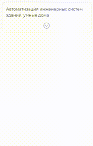
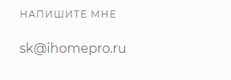

## Демо

[Github Pages](https://pizekatto.github.io/portfolio/)

## Запуск

```bash
npm start
```

## Компоненты

### Collapse



### Modal

Модальное окно открыается при нажатии на картинку из компонента `Collapse`

### Progress


Компонент формируется из JS. Данные уровней прогресса импортируются из [settings.json](https://github.com/Pizekatto/portfolio/blob/master/src/settings.json)

### Карта

- карта сделана на [Mapbox](https://www.mapbox.com/)
- координаты геокодируются через сервис Яндекс Карт
  - запрашиваются у пользователя
  - если отказ, то попытка определить по IP
- при получении фокуса приближается по координатам
- при выходе из поля зрения вращение прекращается, улучшает отзывчивость интерфейса, используется `Intersection Observer`

### Блок `Навыки`

- блок выполнен на `input type="select"` и CSS Grid
- переключается циклично с помощью RxJs

### ScrollSpy

Анимация компонента `Progress` начинается с использованием `Intersection Observer`

### Parallax

Объект параллакса динамически создается только на десктопных разрешении вьюпорта, на мобильных разрешениям удаляется.
Для параллакса использована сторонняя библиотека [rellax](https://github.com/dixonandmoe/rellax)

### Copy



Можно скопировать адрес почты в буфер обмена

## Ресурсы

Использованы некоторые SASS исходники из Twitter Bootstrap для сброса стилей и миксин [Responsive Font Size](https://github.com/twbs/rfs)
